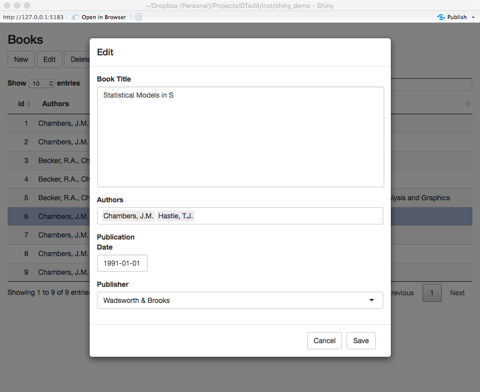

## Editable DataTables for shiny apps.

**Author:** Jason Bryer, Ph.D.
**Email:** jason@bryer.org

Use the `devtools` package to install the development version of `DTedit`:

```r
devtools::install_github('jbryer/DTedit')
```

The `dtedit_demo` will run a sample `shiny` app with to editable data tables.

```r
DTedit::dtedit_demo()
```



#### Getting Started with `DTedit`

You can download a simple shiny app using `DTedit` here: [inst/template/app.R](inst/template/app.R)

There are three steps to using `DTedit` in your shiny application.

1. Define callback function for inserting, updating, and deleting data.

```r
my.insert.callback <- function(data, row) {
	mydata <- rbind(data, mydata)
	return(mydata)
}

my.update.callback <- function(data, olddata, row) {
	mydata[row,] <- data[1,]
	return(mydata)
}

my.delete.callback <- function(data, row) {
	mydata[row,] <- NULL
	return(mydata)
}
```

Typically these functions would interact with a database. As written here, the data would be lost between shiny sessions.

2. Create the `dtedit` object within your `server` function. 

```r
DTedit::dtedit(input, output,
	   name = 'mycontacts',
	   thedata = mydata,
	   edit.cols = c('name', 'email', 'useR', 'notes'),
	   edit.label.cols = c('Name', 'Email Address', 'Are they an R user?', 'Additional notes'),
	   input.types = c(notes='textAreaInput'),
	   view.cols = c('name', 'email', 'useR'),
	   callback.update = my.update.callback,
	   callback.insert = my.insert.callback,
	   callback.delete = my.delete.callback)
```

The `input` and `output` are passed from the `server` function. The `name` parameter will define the name of the object available to the `uiOutput`. The `thedata` is a `data.frame` for the initial view of the data table. This can be an empty (i.e. no rows) `data.frame`. The structure of the `data.frame` will define the inputs (e.g. `factor`s will be drop down, `Date` will use `dateInput`, `numeric`s will use `numericInput`, etc.). There are many other parameters to custom the behavior of `dtedit`, see `?dtedit` for the full list.

3. Use `uiOutput` in your UI to display the editable data table.

The `name` you will pass to `uiOutput` is the name you passed to the `dtedit` created on the server side.

```r
uiOutput('mycontacts')
```
